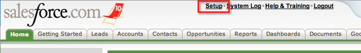
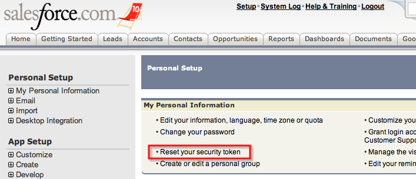

# Loading your SalesForce data into GoodData

<h1 style="color:red">ATTENTION: This example requires the GoodData release 33 which is not generally available yet</h1>

The SFDC example shows how to create a GoodData project that models basic SFDC entities and populate it directly from your SFDC.

_Windows:_

        c:> bin\gdi.sh -u <username> -p <password> examples\sfdc\sfdc.txt
        Project id = 'wuw52aoc8z6rjvd1ufem23zxhdeuukm3' created.
        Data successfully loaded.
        Data successfully loaded.

_Unix like OS (Linux, Mac OS X and others):_

        $ ./bin/gdi.sh -u <username> -p <password> examples/sfdc/sfdc.txt
        Project id = 'wuw52aoc8z6rjvd1ufem23zxhdeuukm3' created.
        Data successfully loaded.
        Data successfully loaded.

Note: this example fetches sample data from GoodData's demo account at SalesForce. 

In order to customize this example to import your own SalesForce data into GoodData, you will need to change the SFDC username, password and security token parameters that are passed to `LoadSfdc` and optionally `GenerateSfdcConfig` commands.

If you don't know your SFDC security token, you can either ask your SFDC administrator for help or generate a new one using the following procedure:

  1. Click the _Setup_ link in SFDC menu:
     
  1. Click the _Reset security token_: TODO screenshot
     
  1. Click the _Reset security token_ button in the following confirmation screen: TODO screenshot
     

An e-mail with the SFDC security token will arrive into your mailbox soon; please check your _spam_ folder if it seems to take too long.
